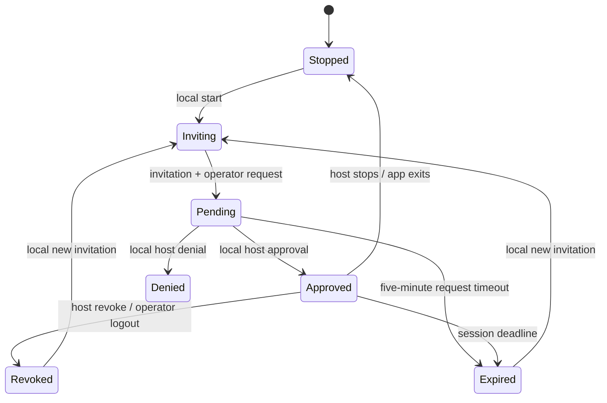

# Architecture

Tether uses inward dependencies: policy has no network, filesystem, process, or desktop dependencies; application services define ports; infrastructure implements them; the desktop composition root selects adapters.

```text
src-tauri/src/
  domain/                 Pairing, session expiry, access policy, command limits
  application/
    mod.rs                Host use cases, process budgets, job ownership
    operator.rs           Operator pairing, credentials, terminal lifecycle
    agent.rs              MCP agent pairing, credential storage, job workflows
    ports.rs              Clock, secrets, audit, shell, remote transport contracts
  infrastructure/
    audit.rs              Append-only JSONL storage
    shell.rs              PTY and bounded command process execution
    process_scope.rs      Windows Job Objects / Unix process groups
    http.rs               Axum HTTP and WebSocket adapter
    remote.rs             Native HTTP/WebSocket operator transport
    tunnel.rs             Bundled cloudflared process and URL detection
  presentation/           Tauri IPC, official Rust SDK MCP adapter, composition root

src/
  contracts.ts            Serialized UI boundary types
  services/desktop.ts     One local IPC gateway
  hooks/useDesktop.ts     Polling, actions, loading and errors
  components/             Role-specific UI and xterm presentation

agent/
  client.mjs              HTTP transport and private credential storage
  tether.mjs              Argument parsing, TTY and CLI presentation
```

The Rust domain depends on serialization and cryptographic utilities, not transport or persistence. Time is an input to its state transitions. The application receives clocks, cryptographic secret sources, audit sinks, process adapters, and operator transports through traits. Session rules are shared by interactive terminals and agent jobs. The desktop app owns host lifecycle and wires the actual TCP listener, tunnel, platform paths, and events.

The UI never executes local commands directly. It invokes named use cases. Credentials remain in Rust memory; the invitation is exposed locally for sharing, while session and polling credentials stay out of the webview. Native operator transport forwards only terminal frames and metadata to the UI. The CLI stores its independently approved token in a private file.

## Session state machine



There is no remotely callable approval endpoint. The invitation expires after ten minutes, a pairing request after five minutes, and an approved session after the selected duration. Only one session can be approved at a time. Authorization is checked on each API request and during WebSocket activity; already running commands are cancelled when the session stops or expires.

## Execution

Four process slots are shared by terminals and command jobs. Commands run in a new noninteractive shell with inherited host-user privileges. Job output is bounded to 1 MiB across stdout and stderr. Jobs have a 1–300-second timeout; completed job storage is bounded. The caller can only inspect or cancel jobs owned by its session.

PTY input/output uses bounded channels and bounded frames. Backpressure closes stalled connections instead of growing memory without limit. Ping/pong detects abandoned terminals. Remote output is sent as base64 to preserve bytes across UTF-8 chunk boundaries; xterm performs decoding. Command output is returned as UTF-8 with replacement for invalid bytes.

On Windows each managed shell is assigned to a Job Object with kill-on-close. On Unix shells use process groups/session leaders. The native shell adapter registers process scopes so stop/revoke can terminate them immediately, including during desktop shutdown. These mechanisms supervise ordinary descendants, not arbitrary persistent changes an authorized shell could make.

## Changes and extension points

- Add file browsing by defining application use cases and a filesystem port, with its own permission semantics. Do not imply a folder sandbox while allowing an unrestricted shell.
- Add another tunnel provider through an infrastructure adapter at the composition root.
- MCP already exposes the same session/job API as a stdio presentation adapter. Add other agent tools here without creating an authorization bypass.
- Add screen control as a distinct permission and platform adapter, with a separate host approval flow.
- Keep the domain free of Tauri, Axum, reqwest, and filesystem/process imports.

Tests are kept next to domain/use cases and adapters, with real loopback HTTP/PTY integration tests and external CLI/UI tests. CI tests platform-specific branches on native runners.

The `desktop` Cargo feature is enabled by default. To exercise policy, HTTP, PTY, process scopes, and the MCP protocol without the webview or bundled desktop assets, run `cargo test --manifest-path src-tauri/Cargo.toml --no-default-features --lib`.
